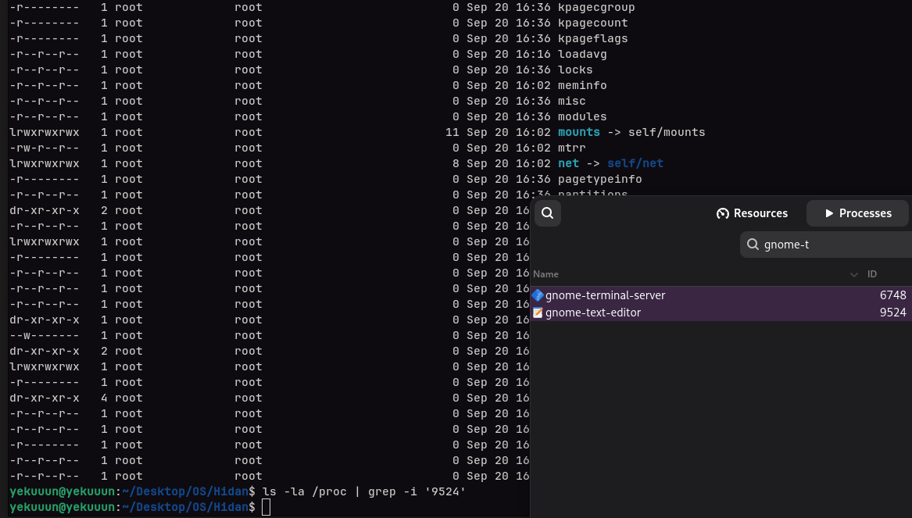
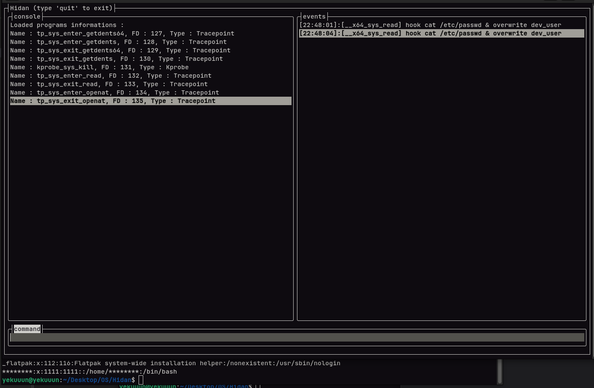
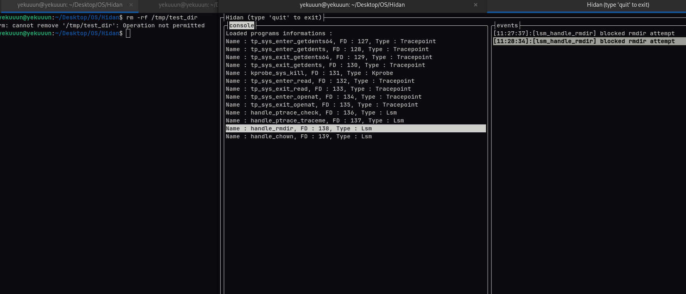

```
                           ___  ___  ___  ________  ________  ________      
                          |\  \|\  \|\  \|\   ___ \|\   __  \|\   ___  \    
                          \ \  \\\  \ \  \ \  \_|\ \ \  \|\  \ \  \\ \  \   
                           \ \   __  \ \  \ \  \ \\ \ \   __  \ \  \\ \  \  
                            \ \  \ \  \ \  \ \  \_\\ \ \  \ \  \ \  \\ \  \ 
                             \ \__\ \__\ \__\ \_______\ \__\ \__\ \__\\ \__\
                              \|__|\|__|\|__|\|_______|\|__|\|__|\|__| \|__|
                                                                            
                     offensive eBPF techniques lab research. linux kernel version > 5.5

```

## `👨‍💻` Overview

Hidan is a personal research laboratory that explores how legitimate eBPF mechanisms can be weaponized in offensive scenarios. Rather than providing ready-to-use pentesting tools, Hidan serves as a comprehensive proof-of-concept for understanding modern kernel-level attack vectors.

> [!Important]
> I can't believe this has to be said but I am _not_ a professional developer... _at all_. I will be making some mistakes and I will never claim that any of my code is the best/most efficient or that any of these techniques are things that I've created/discovered. This project is still under progress and we be continuously updated ;)


### `⚠️` Core Philosophy 
The project demonstrates that **defensive mechanisms designed for legitimate purposes** can be repurposed for offensive objectives. By understanding these techniques deeply, defenders can better protect systems against kernel-level threats.

### 🛠️ Tech Stack
- **Kernel Programs**: Written in eBPF/C with modern hooking techniques (kprobes, kretprobes, LSM hooks, tracepoints)
- **Userland Daemon**: Pure C# userland app built on top of **Mango.Libbpf**. A custom C# library for libbpf bindings I wrote.

---

## 📁 Architecture & Design

### Two-Tier Architecture

```
┌─────────────────────────────────────────┐
│         Userland: C# Daemon             │
│  (eBPF Loading, Mapping, Events)        │
├─────────────────────────────────────────┤
│    Kernel: eBPF Programs (C)            │
│  (Hooks, Interception, Manipulation)    │
└─────────────────────────────────────────┘
```

#### Daemon Component (C#)
Responsible for:
- Loading compiled eBPF object files (.o binaries)
- Mapping eBPF programs to kernel hooks
- Managing eBPF maps for shared kernel-userland data
- Handling event ringbuffer consumption
- Providing CLI interface for runtime control
- Terminal GUI for debugging and monitoring

**Key Libraries**:
- `Mango.Libbpf` - Custom C# wrapper for libbpf => [Official documentation](https://github.com/Yekuuun/Mango)

#### Kernel Component (eBPF)
Implements the actual hooking mechanisms:
- **LSM Hooks** - Linux Security Module framework for policy enforcement
- **Kprobes/Kretprobes** - Kernel function entry/return hooks
- **Tracepoints** - Static instrumentation points
- **Ring Buffers** - High-performance event exfiltration (mostly used for tracing events)

---

## 📁 Project Structure

```
hidan/
├── README.md                         # This file
├── LICENSE                           # MIT License
├── docs/                             # Documentation assets
│
├── scripts/
│   └── vmlinux.sh                    # Generate vmlinux.h for current kernel
│   └── show_debug.sh                 # Show live events when ebf program is loaded (PRINT_DEBUG) statements
│
└── src/
    ├── build_all.sh                  # Master build script
    ├── Makefile                      # Build orchestration
    │
    ├── kernel/                       # eBPF kernel programs
    │   ├── main.bpf.c                # Main eBPF entry point
    │   ├── Makefile                  # Kernel build configuration
    │   ├── includes/                 # Header files (bpf_*.h)
    │   ├── modules/                  # Feature modules (mod_*.h)
    │   ├── lib/                      # Shared utilities
    │   ├── data/                     # Data structures & buffers
    │   ├── bin/                      # Compiled object (main.bpf.o)
    │   └── out/                      # Build artifacts
    │
    └── Deamon/                      # C# Userland Application
        ├── Deamon.csproj            # Project configuration
        ├── AppSettings.json         # Application settings
        ├── Startup.cs               # Initialization logic
        ├── Ebpf/                    # eBPF Integration Layer
        │   ├── Abstraction/         # Interfaces (IEbpf*)
        │   ├── Mapping/             # Map handlers (MapHidePid, etc.)
        │   ├── Events/              # Event processing
        │   ├── Runtime/             # Lifecycle & execution
        │   ├── Debug/               # Debugging utilities
        │   ├── Config/              # Configuration
        │   ├── DTO/                 # Data transfer objects
        │   └── Utils/               # Utility functions
        ├── Cmd/                     # CLI Command Framework
        │   ├── Abstraction/         # Command interfaces
        │   └── Commands/            # Command implementations
        ├── Gui/                     # Terminal UI components
        ├── Logger/                  # Logging system
        ├── Config/                  # DI configuration
        └── Utils/                   # Shared utilities
```

---

## 👺 Offensive Techniques Implemented

### 1. Files, Dir's & process hiding
**Mechanism**: Hook `getdents64()` syscall to filter process entries returned by targetted binaries like ls, ps, etc.



**Implementation**:
- Intercepts directory listing syscalls
- Removes entries matching hidden PIDs, filenames, directory names, from kernel-level ringbuffer cache
- **Impact**: Hidden entries don't appear in `ps`, `top`, or `/proc` enumeration

---

### 2. Read manipulations
**Mechanism**: Hook file access syscalls to selectively hide data inside



**Implementation**:
- Intercepts `open()`, `openat()`, `read()` syscalls
- Overwrite content inside files like `/etc/passwd`
- **Impact**: Some content is overwrite

---

### 3. Directory Operations Blocking
**Mechanism**: Use LSM hooks to prevent specific filesystem operations



**Implementation**:
- LSM `rmdir`, `chown`, `ptrace` hooks
- Prevent directory removal, file deletion, or other operations
- **Impact**: Critical system paths can be immutable without traditional ACLs

---

### 4. Other coming...

---

## 🧰 Dependencies

### System Requirements
- **Linux Kernel**: Version 5.5 or later (eBPF BPF LSM support)
- **Architecture**: x86_64 (primary), ARM64 (tested)
- **Privileges**: Root/sudo required for eBPF program loading

### Build Dependencies

#### Kernel-Space (eBPF)
```bash
# LLVM/Clang toolchain
llvm-dev
clang
llvm

# BPF development
libbpf-dev
linux-headers-$(uname -r)
bpftool

# Optional for development
pahole          # Required for vmlinux.h generation
```

#### Userland (C#/.NET)
```
.NET 10.0 SDK or later & linked nuget packages.
```

### Installation

#### Debian/Ubuntu
```bash
install deps in /scripts/deps.sh
```

---

## `👨‍💻` Building & Installation

### Build Steps

#### 1. Generate vmlinux.h (if not present)
```bash
cd scripts/
./vmlinux.sh
# Generates vmlinux.h for current kernel types
```

#### 2. Build Everything
```bash
cd src/
chmod +x build_all.sh
./build_all.sh
```

This script:
- Compiles eBPF kernel programs (`kernel/Makefile`)
- Builds C# daemon (`dotnet publish`)
- Places output in `out/` directory

#### 3. Run the Daemon
```bash
sudo ./out/deamon
```
---

## Usage & Interactive Commands

Once the daemon is running (`sudo ./out/deamon`), interact via CLI: using the help command

---

## Security Considerations

### Detection & Defense

These techniques can be detected by:
- **Hardware-based monitoring** (Intel PT, etc.)
- **Kernel logs** (`journalctl`, `dmesg`) - may contain hook activities
- **Signed code analysis** - verifying program integrity
- **Secureboot + LSM enforcement** - restricting eBPF loading
- **Audit subsystem** - detailed syscall tracking

---

## Limitations & Scope

### Current Limitations
- **Must run as root** - eBPF program loading requires root privileges
- **Limited scope** - Techniques target specific syscalls/operations
- **Research-only focus** - No advanced obfuscation or anti-forensics
- **Kernel version dependent** - Some hooks vary by kernel version
- **No binary self-protection** - Daemon can be analyzed and reverse-engineered

### What This Is NOT
- ❌ A production rootkit framework
- ❌ Designed for stealth in adversarial environments
- ❌ Anti-forensics or anti-detection oriented
- ❌ Multi-stage exploitation framework
- ❌ Exploit development toolkit

---

## 📚 References & Resources

### eBPF Documentation
- [eBPF Official Documentation](https://docs.ebpf.io/) - Comprehensive eBPF guide
- [BPF & XDP Reference Guide](https://docs.cilium.io/en/v1.12/bpf/) - Cilium's reference
- [Libbpf Documentation](https://github.com/libbpf/libbpf) - C library for eBPF

### Linux Kernel References
- [Linux x64 Syscalls](https://syscalls64.paolostivanin.com/) - Complete syscall reference
- [Linux Kernel Explorer](https://elixir.bootlin.com/) - Source code browser
- [LSM Framework](https://www.kernel.org/doc/html/latest/security/lsm.html) - Security modules docs

### eBPF Debugging
- [eBPF Debugging Guide](https://oneuptime.com/blog/ebpf-debugging-troubleshooting) - Troubleshooting
- [BPF Loader](https://github.com/libbpf/libbpf) - Official loader reference
### Related Research
- [Singularity - Rootkit Research](https://github.com/MatheuZSecurity/Singularity) - eBPF rootkit research
- [TripleCross](https://github.com/Yekuuun/TripleCross) - Advanced eBPF techniques
- [bpfload - Program Loader](https://github.com/libbpf/libbpf-bootstrap) - Bootstrap reference

---

## `🫂` Contributing

I'm open to contribution ! Do not hesitate to contact me on my discord `mrcandieee` to work together.

---

## License

MIT License - See [LICENSE](LICENSE) file
Copyright (c) 2026 0xYkn
